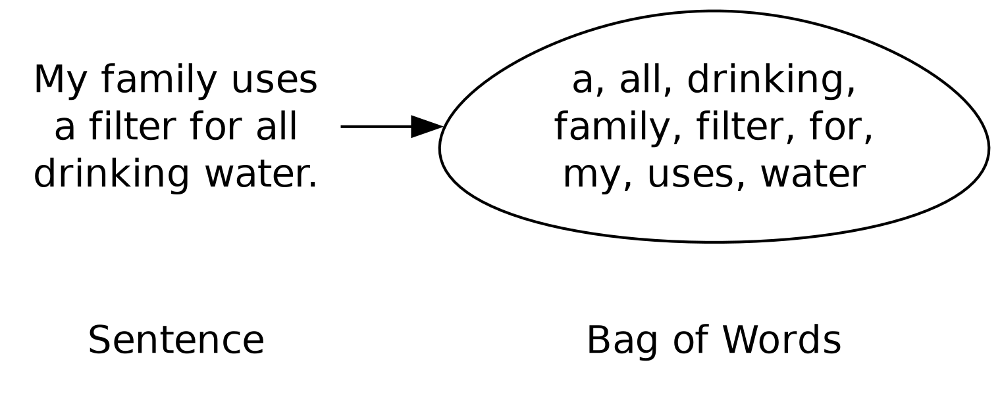
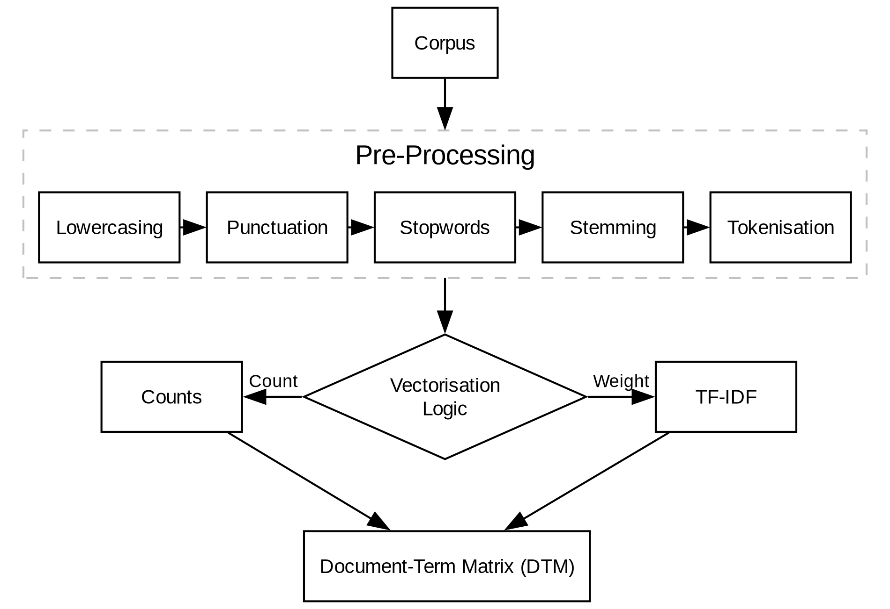
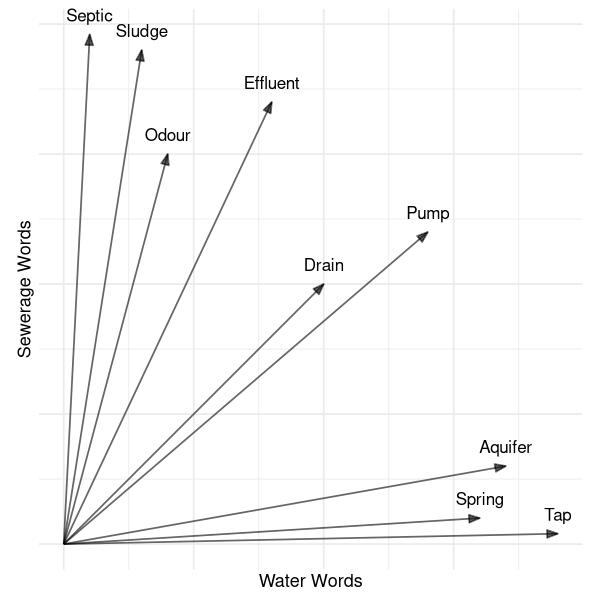
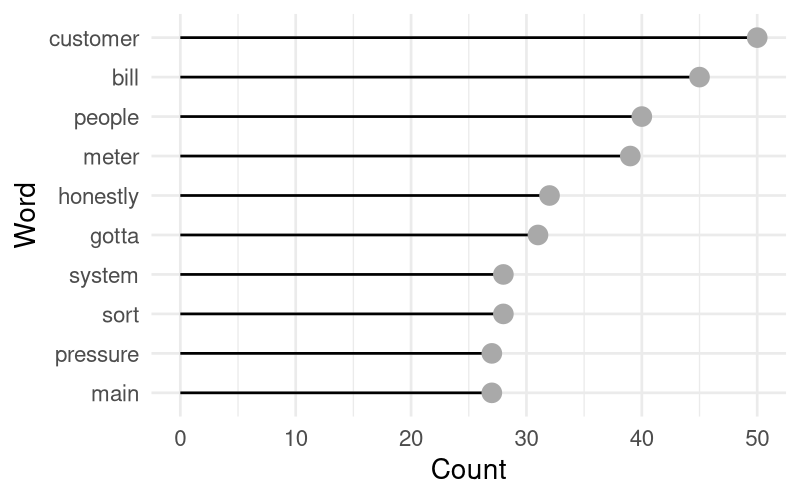
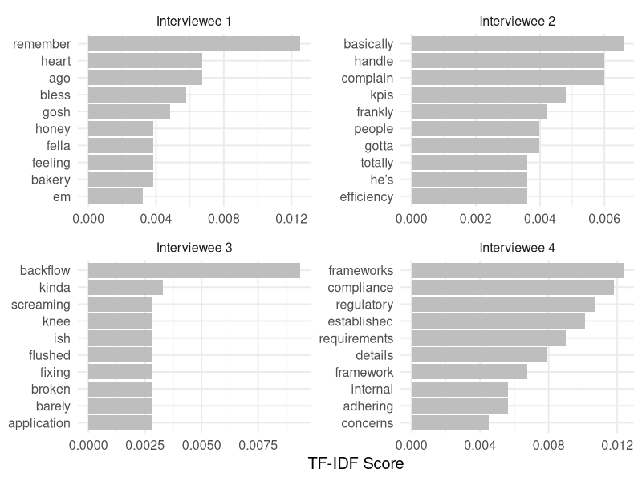

#+title: Introduction to Computational Text Analysis
#+property:     header-args:R :session *R* :exports results :tangle scripts/03-text-analysis-introduction.R
#+bibliography: book/voc.bib
#+cite_export:  csl book/apa6.csl
#+macro:        voc /Voice of the Customer/

Humans have evolved to interpret the nuances and subtleties of language. We can easily understand hidden subtext and interpret intentions when we hear somebody speak or read a text. But there are boundaries to human comprehension. Manually analysing millions of words is a monumental task that exposes the limitations of human cognitive endurance. The large volume of available customer feedback presents a significant challenge for any {{{voc}}} (VOC) program. Computational methods allow us to scale our ability to understand large volumes of text. Many algorithms can efficiently extract meaning from large volumes of text. However, before a computer can make sense out of a text, we need to transform natural language into a structured numeric format.

When analysing technical water measurements, data is usually a time series. We measure pressure, flow, quality, and other parameters at a defined location and time. These measurements can be easily presented in tabular form, with each row representing an observation. Time series data is straightforward to analyse. Natural language data is unstructured and comes to us in many different forms, from streams of short social media messages to massive volumes of text from call or interview transcripts, and so on. 

This chapter discusses how to convert an unstructured text corpus (a collection of texts) into a structured format suitable for computational analysis through tokenisation, Document-Term Matrix and vectorisation techniques. These methods form the foundation of all Natural Language Processing (NLP) techniques and contemporary large language models. This chapter closes with a brief case study that applies these methods to a transcript of a simulated interview with customer service professionals.

* Storing text as Data
Analysing data can occur at different units of analysis, from large to small [cite:@stoltz_2024_txt]. A /corpus/ is a collection of documents (texts), for example, a collection of transcripts of customer phone calls or an extract of social media posts. A /document/ is the main unit of observation, such as a single transcript, complaint, or social media post. To enable analysis, we need to split each document into fragments. Depending on the type of analysis, these fragments have different lengths:

- /Chunk/: A section of a document that consists of one or more paragraphs or sentences.
- /N-gram/: Two or more words (bigram, trigram and so on).
- /Unigram/: A single word, emoticon, hashtag and anything else separated by spaces.
- /Subword/ or /Character/: One or more letters in alphabetical scripts (such as English, Cyrillic, or Greek), a syllable in syllabaries (e.g. Japanese or Cherokee), or a word in logographic scripts such as Chinese.

Splitting a text into units of one or more words, called tokenisation, is the most common approach in VOC applications. Single- or multi-character tokenisation is more suitable when developing deep learning models that require a high level of granularity. Choosing shorter token sizes increases the amount of computer power needed to analyse the corpus. Token size is a tradeoff between the objectives of the analysis and computing cost. We shall see in this book that using the most advanced method does not necessarily lead to better results.

The workflow for computational text analysis starts with a text corpus, and we want to examine the documents it contains. For example, the case study in this chapter uses a series of four simulated interviews. The next chapter uses a corpus of just over 100 social media posts about tap water to estimate how people feel about this service. Chapter [[#chap-topics]] analyses a corpus of hundreds of simulated customer calls to their water utility and classifies their concerns into topics.

Tokenised texts are a good starting point for exploring the content of a corpus or for simple sentiment analysis (chapter [[#chap-sentiment]]). For more complex applications, such as topic analysis (chapter [[#chap-topics]]), we need to express a corpus as a Document-Term Matrix. With the advent of deep learning, we can also convert text to numeric vectors that embed meaning by grouping words that are in proximity to each other.

* Tokenisation
The first step in most text analysis projects is tokenisation, which splits a human-readable text into smaller units of analysis, usually /n/-gram or smaller. The text below is an extract from a simulated conversation between a market researcher and a water utility customer used to demonstrate tokenisation techniques:

#+begin_quote
Honestly, I don’t really think about the water until there’s a problem. I guess my confidence is mixed. Most of the time, it looks perfectly clear, but sometimes, especially in the summer, it has a really strong chlorine smell, almost like a swimming pool. Because of that, my family actually uses a filter for all our drinking water to remove the smell. I trust it enough to shower and cook with, but I wouldn't just drink a glass straight from the bathroom sink because I don't like smelling chlorinated water. 
#+end_quote

Tokenisation interprets a text as a 'Bag of Words'. This approach represents a document as an unordered collection (the bag) of /n/-grams (usually single words), ignoring grammar, syntax, and word order [cite:@stoltz_2024_txt;@atteveldt_2021_comp]. For example, tokenising the customer quote into a Bag of Words typically involves counting the occurrence of each word. In our example, "water" and "smell" appear twice, and "chlorine" appears once, and so on. This approach ignores the order of words and focuses on their occurrence [[fig-bow]].

#+begin_src dot :file images/text-bag-of-word.png 
  digraph bow {
    dpi=300
    rankdir="LR"
    node[fontname="Helvetica"]
    Sentence[shape="none"]
    bow[shape="none", label="Bag of Words"]
    Sentence -> bow [style=invis]
    sent[shape="none", label = "My family uses\na filter for all\ndrinking water."]
    bag[shape="egg", label="a, all, drinking,\nfamily, filter, for,\nmy, uses, water"]
    sent -> bag
  }
#+end_src
#+caption: From natural language to a bag of words.
#+name: fig-bow
#+attr_latex: :width 0.6\textwidth
#+RESULTS:

Before tokenising a text, we need some pre-processing. The most common first step in tokenisation workflows is to convert the text to lowercase and remove punctuation, except hyphens and apostrophes. Some applications also remove numbers and redundant whitespace. The level of pre-processing depends on the purpose of the analysis.  In some more advanced applications, exclamation and question marks are retained. When analysing social media, we also need to consider emoticons, hashtags and other domain-specific symbols.

We can tokenise the example text into individual words and count the frequency of each word, as shown in table [[tab-unigrams]]. The first obvious observation is that this tokenisation is not informative. The top four words are articles and pronouns, which linguists call /function words/. These are words that have little or no lexical meaning and express grammatical relationships within a sentence. In contrast, /content words/ possess semantic content and express the meaning of the sentence in which they occur. The noun "water" is the fifth most common word in this paragraph and signifies the topic of the conversation.

#+begin_src R :colnames yes :tangle no
  answer <- data.frame(text = "Honestly, I don’t really think about the water until there’s a problem. I guess my confidence is mixed. Most of the time, it looks perfectly clear, but sometimes, especially in the summer, it has a really strong chlorine smell, almost like a swimming pool. Because of that, my family actually uses a filter for all our drinking water to remove the smell. I trust it enough to shower and cook with, but I wouldn't just drink a glass straight from the bathroom sink because I don't like smelling chlorinated water.")

  library(tidytext)
  library(dplyr)

  unigrams <- answer |>
    unnest_tokens(word, text) |>
    count(word) |>
    select(Word = word, Count = n) |>
    arrange(desc(Count))

  head(unigrams, n = 5)
#+end_src
#+name: tab-unigrams
#+caption: Top five words in the example text.
#+RESULTS:
| Word  | Count |
|-------+-------|
| a     |     5 |
| i     |     5 |
| the   |     5 |
| it    |     3 |
| water |     3 |

Text analysis software includes the capability to remove function words from the corpus to focus on the text's meaning. Data scientists call these stopwords because they are removed or 'stopped' before the analysis commences. Analytic workflows contain predefined lexicons of stopwords, but analysts can also define domain-specific stopwords [cite:@atteveldt_2021_comp]. For example, in a text about a water utility, the word "water" is uninformative and redundant. While water is the core subject of the text, removing it from the text prevents it from compressing the rest of the text, allowing more important words to surface. Which words to remove depends on the analysis's context. In a generic corpus, "water" is a content word, so it should be retained, but in a water utility context, it becomes a domain-specific stopword that could be ignored.

Profanity can be another category of stopwords. Most people regularly use swear words, and about half a per cent of all words spoken in daily conversation are profanity. In social media posts, profanity occurs in over 7% of posts. Most digital platforms remove swear words from public comments by using profanity lexicons, such as Google's '=badwordlist='. But profanity is relative, as one person's swear word is another person's term of endearment. Profanity lexicons are also highly culturally dependent. Within the English-speaking world, not all swear words are shared between all countries. However, zealously removing profanity can remove important semantic information about the sentiment of a text (chapter [[#chap-sentiment]]). When a consumer uses string language in a review, readers make inferences about their word use [cite:@lafreniere_2022_prof].

Removing stopwords should always be handled with care. Whether a certain word should be stopped from forming part of the analysis depends on the type and context of the research question you are seeking to answer.

After removing standard stopwords, including the obvious word "water", our top-five words (with ties listed alphabetically) look like table [[tab-no-stopw]]. This list is much more informative than the first version and provides insight into the main issue. 

#+begin_src R :colnames yes :tangle no
  unigrams_stopped <- answer |>
    unnest_tokens(word, text) |>
    anti_join(stop_words, by = "word") |>
    filter(word != "water") |>
    count(word) |>
    arrange(desc(n)) |>
    select(Word = word, Count = n)

  head(unigrams_stopped, n = 5)
#+end_src
#+name: tab-no-stopw
#+caption: Most common words in the example text, excluding stopwords.
#+RESULTS:
| Word        | Count |
|-------------+-------|
| smell       |     2 |
| bathroom    |     1 |
| chlorinated |     1 |
| chlorine    |     1 |
| confidence  |     1 |

Stopping words from being analysed needs to be handled with care. While most stopwords can be considered noise, some form part of the signal. If the main research question is to determine the sentiment of a text, then it is best not to remove any words because words like "not" invert the meaning of the following words. When the main research problem is determining the topics of a corpus, some words are best removed so the analysis can focus on those that express meaning.

Single-word tokenisation can obscure the meaning of a text by erasing the relationships between words. We can partially rectify this problem by using /n/-grams. Table [[tab-bigrams]] shows the first five bigrams (sequences of two words) of the sample text. Tokenising a text with bigrams splits the text into overlapping word pairs. In this example, bigrams such as "strong chlorine" and "don't like" preserve meaning that would otherwise be lost in single-word tokenisation. In this small example, using bigrams may not be the most effective tokenisation strategy, since the text is short and each bigram appears only once.

#+begin_src R :colnames yes :tangle no
  bigrams <- answer |>
    unnest_tokens(word, text, token = "ngrams", n = 2) |>
    mutate(token = 1:n()) |>
    select(Token = token, Bigram = word)

  head(bigrams, n = 5)
#+end_src
#+name: tab-bigrams
#+caption: First five bigrams of the example text.
#+RESULTS:
| Token | Bigram       |
|-------+--------------|
|     1 | honestly i   |
|     2 | i don’t      |
|     3 | don’t really |
|     4 | really think |
|     5 | think about  |

Using /n/-grams splits a text into groups of two (bigram) or more words (trigram and so on). This method preserves some of the structure but comes at a cost, as the number of unique tokens can increase dramatically due to /n/-gram overlap. While the example text has 66 unique words, the bigram model has 89 unique terms. The /n/-gram model enhances semantic analysis, but it increases the computational effort to analyse data. Bigrams increase dimensionality, but they are often the only way to catch differences between, for example, "not good" and "good", further discussed in chapter [[#chap-sentiment]].

* Stemming and Lemmatisation
:NOTES:
- [X] [[https://www.ibm.com/think/topics/stemming][What Is Stemming? | IBM]]
- [X] [[https://cloud.google.com/discover/what-is-stemming][What is stemming and how does it work? | Google Cloud]]
:END:
Pre-processing techniques, such as converting all text to lowercase, removing stopwords, numbers, whitespace, and punctuation, normalising the text, and reducing model size, still leave us with some of the vagaries of natural language. In alphabetic languages, the same word can appear in numerous inflected forms. People might use words such as  "connection", "connections", "connected", "connecting", or "connect" when applying to become a new tap water customer. This variety of words can be problematic when using a literal search. Searching for "connected" would only find one of these instances. Using different versions of the same word also increases the data model. Two further techniques for reducing the dimensionality of text are stemming and lemmatisation.

Stemming simplifies inflected words by replacing them with their stems or roots. In the example connections example, all five words stem to "connect-", by removing the endings. Various stemming algorithms are available for different languages [cite: @pant_2025_stem;@singh_2016_text;]. They use language-specific rules to transform a text, for example, stripping suffixes, such as "-en", '-ing", "-ion", and "-ly", in English text. Word stemming can lead to over simplification because two different words can be stemmed to become the same. For example, "university" and "universal" both stem to "univers-".

#+begin_src R :results none :eval no :tangle no
  # Example of stemming using the Snowball algorithm
  library(SnowballC)

  wordStem(c("connection", "connections", "connected", "connecting", "connect"), language = "english")

  wordStem(c("university", "universal"))

  wordStem(c("can't", "don't"))
#+end_src

Stemming algorithms are not entirely accurate because human language is logically inconsistent. Stemming struggles with irregular verbs, such as forms of "to be". The rule-based approach to stemming can, as a result, yield terms that are not real words.

Lemmatisation is a more linguistically accurate technique that considers the broader context of each word. Lemmatisation uses dictionaries and part-of-speech tagging to distinguish between verbs, nouns, and other word types. However, lemmatisation is a lot more computationally intensive approach and might not be necessary for business applications, such as {{{voc}}} research.

When stemming the example text from the previous section with the [[https://snowballstem.org][Snowball string processing library]] [cite:@porter_2001_snow], we see that the stem of "chlorine" and "chlorinated" becomes the non-existing word "chlorin", which isn't a word but serves as a token that captures the shared meaning of "chlorine" and "chlorinated". The benefit of this stemmed term is that, instead of two words with a count of one each, we have one term with a count of two, highlighting the importance of chlorine to the taste experience in this example.

#+begin_src R :colnames yes :tangle no
  unigrams_stemmed <- answer |>
    unnest_tokens(word, text) |>
    anti_join(stop_words, by = "word") |>
    filter(word != "water") |>
    mutate(word = SnowballC::wordStem(word)) |>
    count(word, name = "Count") |>
    arrange(desc(Count)) |>
    select(Word = word, Count)

  head(unigrams_stemmed, n = 5)
#+end_src
#+name: tab-stemmed
#+caption: Stemmed word frequencies.
#+RESULTS:
| Word     | Count |
|----------+-------|
| smell    |     3 |
| chlorin  |     2 |
| drink    |     2 |
| bathroom |     1 |
| confid   |     1 |

Tokenisation is computationally efficient and conceptually simple. However, the Bag-of-Words model loses semantic context by ignoring word order. The tokenisation of "the water is bad, not good" is identical to that of "the water is good, not bad", even though the meaning of these phrases diverges. Despite this limitation, this approach remains highly effective for exploratory analysis.

* Document-Term Matrix
:NOTES:
- [X] Concept: Explain that rows = documents and columns = unique words (terms).
- [X] Sparsity: Mention that most cells will be zero (since one customer doesn't use every word in the English language).
- [X] Weighting (TF-IDF)
:END:
Counting the frequency of content words in a document is useful for exploring a single document or text, but this method has limitations when seeking structure in a corpus. To convert multiple documents into a numeric data object, we need to convert a collection of one-dimensional vectors of word frequencies to a matrix. In a Document-Term Matrix (DTM), each row represents a document in the corpus and each column a word. The matrix has as many rows as there are documents and as many columns as there are unique terms in the corpus. Converting a text to a matrix opens the door to using linear algebra to analyse a corpus. A DTM bridges the gap between unstructured qualitative text and structured quantitative data, enabling advanced statistical analysis.

To create a DTM from the example text, we need to split it into five sentences, so that each sentence becomes a 'document', or row in the matrix. Each unique term in the text is a column, and the numbers represent how often each word appears in each document. The first seven columns of the DTM for the example paragraph (stopwords removed and stemmed) look like table [[tab-dtm]]. We see here, for example, that the term "chlorin" appears once in sentences 3 and 5.

#+begin_src R :colnames yes :tangle no
  # Create Document-Term Matrix
  sentences <- answer |>
    unnest_tokens(sentence, text, token = "sentences") |>
    mutate(document = paste("Sentence", row_number()))

  dtm <- sentences |>
    unnest_tokens(word, sentence) |>
    anti_join(stop_words, by = "word") |>
    filter(word != "water") |>
    mutate(word = SnowballC::wordStem(word)) |>
    count(document, word) |>
    cast_dtm(document, word, n)

  dtm_matrix <- as.matrix(dtm)

  # displayfirst seven columns
  bind_cols(data.frame(Sentence = LETTERS[1:nrow(dtm_matrix)]),
            as.data.frame(dtm_matrix[, 1:7]))
#+end_src
#+name: tab-dtm
#+caption: First seven columns of the Document-Term Matrix for the example.
#+RESULTS:
| Sentence | don’t | honestli | there’ | confid | guess | mix | chlorin |
|----------+-------+----------+--------+--------+-------+-----+---------|
| A        |     1 |        1 |      1 |      0 |     0 |   0 |       0 |
| B        |     0 |        0 |      0 |      1 |     1 |   1 |       0 |
| C        |     0 |        0 |      0 |      0 |     0 |   0 |       1 |
| D        |     0 |        0 |      0 |      0 |     0 |   0 |       0 |
| E        |     0 |        0 |      0 |      0 |     0 |   0 |       1 |

A typical feature and also a problem of a Document-Term Matrix is its sparsity. Most cells contain a zero because a single document (in this case, a sentence) only uses a fraction of the global vocabulary of the corpus. In real-world applications with thousands of documents, these gigantic matrices can contain over 99% zeros. 

While counting raw frequencies is a logical starting point, it cannot distinguish between long and short texts. The tokenisation examples showed that common words like "water" or function words will dominate the matrix, potentially drowning out specific, meaningful issues like "chlorine" or "filter". To resolve this and give more weight to words that distinguish documents from one another, data scientists use a weighting technique called /Term Frequency-Inverse Document Frequency/ (TF-IDF). The TF-IDF measures how important a term is within a document relative to the whole corpus. The TF-IDF is the product of two measures: the Term Frequency (TF) and the Inverse Document Frequency (IDF) .

The Term Frequency for each term in a document measures how frequently a term $t$ occurs in document $d$. The basic assumption is that a word that appears often in a single document must be  significant. The Term Frequency $TF(t, d)$ is the total number of times a term appears in a document ($f(t,d)$), divided by the number of terms in the document ($T_d$). The Term Frequency tells us something about the topic of an individual document, so the same word can have different scores across documents.

$$TF(t, d) =\frac{f(t,d)}{T_d}$$ 

The Inverse Document Frequency $IDF(t)$ measures how important a term is within a corpus. A high score signals that a word is rare across the whole collection of documents. If a word appears in every document (such as stopwords), it receives a low score. The IDF of a term is the logarithm of the quotient of the total number of corpus documents $N$​and the number of documents containing term $D(t)$. Using the logarithm dampens the effect of high frequencies. It ensures that the IDF for words that appear in every document is zero because in that case $D(t) = N$.

$$IDF(t) = \log \frac{N}{D(t)}$$

The TF-IDF score for each term is $TF(t,d) \times IDF(t)$ and replaces the plain counts in the Document-Term Matrix. Let's demonstrate this concept with these short sentences:

a. Tap water contains minerals
b. Tap water contains lead
c. Tap water contains some nitrite

Table [[tab-tf-idf]] shows the Document-Term Matrix using the TF-IDF of the stemmed words instead of word counts. The term "nitrit-" (stemmed from "nitrite") has a score of 0.22 in sentence E because its term frequency is 0.2 (one word from five words) and its Inverse Document Frequency is $\log 3$ because the term appears in one out of three sentences, which results in a score of 0.22. The score for the phrase "tap water contains" is 0 across all sentences because it is common to all sentences. This is true only if those words appear in every document in the corpus. We can eliminate these three words from the matrix because they don't contribute to our understanding of these texts. The words with a non-zero score indicate which topics are of importance to the speaker of each document. The score depends on the length of each text, so in longer texts, we can distinguish between the most important words based on their relative frequency. The TF-IDF method tells us which words are most relevant in each document, and, conversely, which document is most relevant to each word.

#+begin_src elisp :exports none :eval no
  (* (/ 1.0 5) (log (/ 3.0 1)))
#+end_src
#+begin_src R :colnames yes :tangle no
  library(dplyr)
  library(tidytext)

  text_df <- data.frame(doc_id = LETTERS[1:3],
                         text = c("tap water contains minerals",
                                 "tap water contains lead",
                                 "tap water contains some nitrite."))

  dtm_matrix <- text_df |>
    unnest_tokens(word, text) |>
    count(doc_id, word, sort = TRUE) |>
    mutate(word = SnowballC::wordStem(word)) |>
    bind_tf_idf(word, doc_id, n) |>
    mutate(across(where(is.numeric), \(x) round(x, 2))) |>
    cast_sparse(doc_id, word, tf_idf) |>
    as.matrix()

  bind_cols(text_df, as.data.frame(dtm_matrix[, sort(colnames(dtm_matrix))])) |>
    select(-text, Sentence = doc_id)
#+end_src
#+caption: Example Document-term Matrix with TF-IDF.
#+name: tab-tf-idf
#+RESULTS:
| Sentence | contain | lead | miner | nitrit | some | tap | water |
|----------+---------+------+-------+--------+------+-----+-------|
| A        |       0 |    0 |  0.27 |      0 |    0 |   0 |     0 |
| B        |       0 | 0.27 |     0 |      0 |    0 |   0 |     0 |
| C        |       0 |    0 |     0 |   0.22 | 0.22 |   0 |     0 |

For a large collection of long documents, this approach removes noise words and finds the specific topics or sentiments that differentiate one document from another. The TF-IDF method effectively removes stopwords because it mathematically identifies what makes a document unique, without requiring a manual list. This method might not remove all lexicon stopwords, but the ones that remain are clearly important to the relevant speaker.

In the previous sections, we started with a corpus and applied one or more pre-processing techniques. We then had two options to create a Document-Term Matrix. The content of this matrix can either be based on the raw word counts or the TF-IDF (figure [[fig-workflow]]).

#+begin_src dot :file images/text-dtm-workflow.png
  digraph DTM_Workflow {
      compound=true
      rankdir=TB
      nodesep=0.1
      dpi=300
      
      node [shape=rectangle, fontname="Arial", fontsize=10]
      edge [fontname="Arial", fontsize=9]
      input [label="Corpus", shape=box]
      
      subgraph cluster_preprocessing {
          label = "Pre-Processing" fontname="Arial"
          style = "dashed"
          color = gray
          {rank=same lower punct stop stem token}
          lower [label="Lowercasing", width=1]
          punct [label="Punctuation", width=1]
          stop  [label="Stopwords", width=1]
          stem  [label="Stemming", width=1]
          token  [label="Tokenisation", width=1]
          lower -> punct -> stop -> stem -> token
      }

      input -> stop [lhead=cluster_preprocessing]
      stop -> choice [ltail=cluster_preprocessing]
      
      choice [label="Vectorisation\nLogic", shape=diamond]

      tf    [label="Counts", width = 1]
      tfidf [label="TF-IDF", width=1]
      matrix [label="Document-Term Matrix (DTM)", shape=box, width=1]

     {rank=same; tf; choice; tfidf}
     tf -> choice [dir=back, label="Count"]
     choice -> tfidf [label="Weight"]

      tf -> matrix
      tfidf -> matrix
  }
#+end_src
#+caption: Unstructured text processing pipeline.
#+name: fig-workflow
#+attr_latex: :width 0.8\linewidth
#+RESULTS:

We have worked our way up from plain word-count vectors to a Document-term Matrix, and improved it with word stemming and the Term Frequency-Inverse Document Frequency. But none of these methods can encode meaning. Synonyms are still seen as separate words, and matrix methods ignore word order.

* Word Embeddings
Language is an interconnected network of meanings signified by words. If you remove a word from its neighbours, as in the Bag of Words approach, it loses its meaning. Human languages are also complicated by homonymy and polysemy: the same words with different meanings, or different words with the same meaning. For example, the word "water" can be both a verb and a noun within the same sentence: "I water the garden using water". Bag-of-Words approaches can embed a word's importance in a matrix, but not its meaning.

Influential linguist John [cite/t:@firth_1962 p. 11;] wrote: "You shall know a word by the company it keeps". Following this quote, to retain meaning in our mathematical representation of a text, we need to account for how a word relates to the nearby words. Using /n/-grams retains some word order, but it significantly increases the size of the data model. Meaning isn't just internal to a word; it is distributional. For example, to understand "chlorine," you must consider how often it is proximate to "taste" versus "disinfection".

Text embedding is a set of advanced methods for converting text into a sequence of numbers. A vector embedding is a long array of numbers representing the semantic meaning of a word or a sequence of text. These techniques are used in neural networks and large language models. The most common method is /Word2Vec/. This method trains a neural network on a large corpus, such as the entire Wikipedia. Using a neural network, the model learns the structure of language by predicting missing words or nearby words. The result of this training is that each word can be expressed as a vector with hundreds of numbers. The vector represents words as points in a hyper-dimensional plane. Because the model optimises predicting next or neighbouring words, the vectors don't encode word frequencies, but their relationships to other words. Vectors are beneficial over sparse DTMs because they don't contain any zeros. A vector database has no empty space compared to the typical Document-Term Matrix.

To illustrate word proximity in embeddings, we can use a simple example with two dimensions for words related to sewerage and water (figure [[fig-embed]]). In this sample diagram, we can see that the sewerage and water-related words are close together, with ambiguous words in between.  While a Document-Term Matrix (DTM) treats "effluent" and "odour" as two entirely separate columns, vector embeddings recognise their semantic proximity.

The angle between the vectors expresses the similarity between words or phrases. This mathematical representation enables semantic search. Rather than hoping for the best when entering a search term, semantic search can find text that has a vector embedding that is close to the vector of the input, which means that it will parse synonyms and the context of your search. Vectors are also useful for clustering texts to identify similarities.

#+header: :file images/text-embedding-example.png :width 600 :height 600
#+begin_src R :results output file graphics :tangle no
  library(tidyverse)

  embedding_data <- tribble(
    ~word,      ~water_axis, ~sewerage_axis,
    "Tap",      0.95,        0.02,
    "Spring",   0.80,        0.05,
    "Aquifer",  0.85,        0.15,
    "Effluent", 0.40,        0.85,
    "Odour",    0.20,        0.75,
    "Sludge",   0.15,        0.95,
    "Septic",   0.05,        0.98,
    "Drain",    0.50,        0.50,
    "Pump",     0.70,        0.60)

  ggplot(embedding_data, aes(x = water_axis, y = sewerage_axis)) +
    geom_segment(aes(x = 0, y = 0, xend = water_axis, yend = sewerage_axis),
                 arrow = arrow(length = unit(0.4, "cm"), angle = 20, type = "closed"), 
                 alpha = 0.6) +
    geom_text(aes(label = word), vjust = -1, hjust = 0.5, size = 6) +
    coord_fixed() +
    labs(x = "Water Words",
         y = "Sewerage Words") +
    theme_minimal(base_size = 18) +
    theme(axis.text = element_blank())
#+end_src
#+name: fig-embed
#+caption: Example of a two-dimensional vector embedding.
#+attr_latex: :width 0.5\textwidth
#+attr_org: :width 400
#+RESULTS:

Neural networks create static vector embeddings for individual words. Each word has a fixed coordinate in the hyper-dimensional space. While this is a leap forward compared to the DTM, it has a fundamental flaw because it cannot handle polysemy, which is words with multiple meanings. In a static model, the word "service" in "The service pipe is leaking" and "The customer service was excellent" is represented by the exact same vector. The model essentially "averages" the two meanings, potentially introducing noise into the analysis.

Modern Large Language Models solved this by using contextual embeddings. Instead of looking for a word in a fixed vector dictionary, the model generates vectors based on every other word in the sentence. This is achieved through a mechanism called Self-Attention. When the model processes the word "service," it "pays attention" to the surrounding words. If the model detects "pipe" and "leaking", the vector for "service" shifts toward the technical/infrastructure space. If it sees "representative" and "helpful," the vector shifts toward the emotional experience cluster.

The principles of using embedding vectors are the same, so we can use them to see how similar two texts are. These embedding models use thousands of dimensions, allowing for high-level granularity and semantic relationships. These models are useful for determining a customer's sentiment in a statement or classifying it as a complaint, service request, or other type of contact.

When starting a VOC project, the Document-Term Matrix (especially with TF-IDF) is often the best first look to explore the data. Embeddings and LLMs should be used when answering more complex questions, such as "Is this customer actually angry, or just using technical language?"

* Exploratory Analysis Case Study
The case study for this chapter consists of simulated interviews with four customer service professionals who work at a water utility. Each agent had a different background, personality, and language use, and was asked the same ten questions. The objective of this exploratory analysis is to examine the interviewees' responses. This case study analyses cultural differences between service employees by analysing how they respond to these questions. While not directly a {{{voc}}} analysis, the 'Voice of the Employee' is an important determinant in how customers experience their service. 

The four transcripts were generated using the /Gemini 2.0 Flash/ model. The code used to generate the interviews, the transcripts, and the code to analyse them are available in this book's Git repository. Please note that the personas and their responses are totally fabricated, and any similarities with real water people or organisations are coincidental.

#+begin_src R :results none
  # Exploratory analysis of simulated interviews
  library(tidyverse)
  library(tidytext)

  # ETL
  interview_files <- list.files("data/synthetic-interviews", full.names = TRUE)

  parse_transcript <- function(file_path) {
    raw_text <- read_file(file_path)
    # Extract the interview number
    interview_id <- str_extract(basename(file_path), "\\d+")
    # Split the content by the "INTERVIEWER:" tag
    sections <- str_split(raw_text, "INTERVIEWER:")[[1]]
    # Remove the first empty element if it exists (text before the first question)
    sections <- sections[sections != ""]
    map_df(sections, function(sec) {
      # Split the section into Question and Agent response
      parts <- str_split(sec, "AGENT:")[[1]]
      if (length(parts) >= 2) {
        tibble(
          interview_nr = as.integer(interview_id),
          question = str_trim(parts[1]),
          response = str_trim(parts[2])
        )
      } else {
        NULL # Handle cases where there is no response (e.g., final comments)
      }
    })
  }

  # Read and combine all transcripts into one data frame
  interview_data <- map_df(interview_files, parse_transcript)

  # Tokenise by word and count their frequency
  interview_tokens <- interview_data |>
    unnest_tokens(word, response) |>
    anti_join(stop_words, by = "word") |>
    filter(!str_detect(word, "^[0-9]+$"))
#+end_src

The first step in exploring a corpus is to tokenise the text and visualise its word distribution. The first step reads the raw data files, separates the interviewer's words from the respondent's, and tokenises the answers, removing standard stopwords.

Viewing the most common words in a text can provide a quick summary of its content. Word clouds, also known as a tag cloud, are a common method to summarise text (figure [[fig-cloud]]). This type of visualisation first appeared on websites in the 2000's to summarise their content. The basic principle is that the more common words appear larger. Words can also be randomly rotated for aesthetic reasons, and colours can visualise groups within the data.

#+header: :file images/text-word-count-cloud.svg
#+header: :width 400 :height 300
#+begin_src R :results output file graphics 
  # Generate the Wordcloud (top 100 words)
  library(ggwordcloud)

  word_counts_cloud <- interview_tokens |>
    count(word, sort = TRUE) |>
    top_n(50) |>
    mutate(rotation = sample(c(0, 90), n(), replace = TRUE))

  ggplot(word_counts_cloud) +
    aes(label = word, size = n, angle = rotation) +
    geom_text_wordcloud(shape = "square", rm_outside = TRUE) +
    scale_size_area(max_size = 15) +
    coord_fixed() +
    theme_void()
#+end_src
#+caption: Wordcloud of the 100 most common words in the interviews.
#+attr_html: :width 600 :height 400
#+name: fig-cloud
#+RESULTS:

Word clouds are popular, but they are more decorative than useful as an analytical data visualisation. Word clouds use a lot of space to convey a small amount of information. They have a low 'data-to-ink-ratio' [cite:@tufte_2001_visual p. 93;]. This ratio (nowadays better referred to as the data-to-pixel ratio) indicates the fewest pixels needed to convey the most information. This ratio indicates the information density of a visualisation [cite:@prevos_2019_prin]. Word clouds have a low information density and require the user to process word in random locations.

A bar chart is a more informative method to visualise word frequencies. Before creating a bar chart, we need to perform some additional preprocessing. The word cloud contains many uninformative discourse markers and filler words. Words such as "yeah", "um", and "ah" perform a function in a conversation, but do not enhance the content. The word "water" could also be removed without impacting any conclusions. The image in figure [[fig-freq]] shows the ten most common words used by the interviewees. This type of visualisation is more informative because we can very quickly ascertain the topics discussed in these interviews.

#+header: :file images/text-word-count-barchart.png
#+header: :width 800 :height 500
#+begin_src R :results output file graphics
  # Remove filler words and generate barchart
  word_counts_bar <- interview_tokens |>
    filter(word %notin% c("water", "um", "ah", "ya", "yeah", "em", "eh",
                          "uh", "mate", "bit", "bloody", "time", "righto")) |>
    count(word, sort = TRUE) |>
    top_n(10) |>
    mutate(word = fct_reorder(word, n))

  ggplot(word_counts_bar) +
    aes(word, n) +
    geom_segment(aes(xend = word, yend = 0)) +
    geom_point(size = 8, col = "darkgrey") +
    coord_flip() +
    theme_minimal(base_size = 28) +
    labs(x = "Word", y = "Count")
#+end_src
#+caption: Word frequencies of interviews.
#+name: fig-freq
#+RESULTS:

Manually removing filler words requires judgment over which words are important and which ones are not. The analyst needs to determine which words are part of the signal and which are noise. Using a mathematical approach to visualise the TF-IDF removes subjectivity and might yield more useful results.

Visualising the ten words with the highest TF-IDF for each interview identifies which words are most important or unique to a specific interviewee, relative to the corpus. The chart in figure [[fig-tfidf]] visualises the top-ten TF-IDF scores for each interviewee. This overview enables drawing conclusions about the differences in language use. In this case, we can learn more about each interviewee's profile. We could use the same approach to compare the answers to the ten questions.

#+header: :file images/text-tf-idf-barchart.png
#+header: :width 800 :height 600
#+begin_src R :results output file graphics
  # Visualise TF-IDF
  interview_tfidf <- interview_tokens |>
    count(interview_nr, word, sort = TRUE) |>
    bind_tf_idf(word, interview_nr, n) |>
    group_by(interview_nr) |>
    slice_max(tf_idf, n = 10, with_ties = FALSE) |>
    ungroup() |>
    mutate(interview_nr = paste("Interviewee", interview_nr))

    ggplot(interview_tfidf) +
      aes(tf_idf,
          reorder_within(word, tf_idf, interview_nr)) +
      geom_col(fill = "grey") +
      scale_y_reordered() +
      facet_wrap(~interview_nr, scales = "free") +
      labs(x = "TF-IDF Score",
           y = NULL) +
      theme_minimal(base_size = 20)
#+end_src
#+caption: Highest TF-IDF Words by Interview
#+name: fig-tfidf
#+RESULTS:

The TF-IDF method provides word counts, but it does not explain the meaning of these words. The graph by itself is meaningless and does not provide any clear insight. We need to move from the 'thin description' of numbers to a 'thick description', moving from quantitative metrics to qualitative meaning. We are essentially converting a qualitative narrative into numeric data and then back to qualitative information. To make sense of the TF-IDF results, we need to reconstruct the context in which they were recorded. To achieve this goal, we can use either natural intelligence or its artificial counterpart; we can either have humans place these words in context or deploy a large language model.

The traditional method is to ask a group of people to interpret the results. You provide the results to each team member and ask them to interpret them by converting the most common words into a narrative for each respondent in this case. This method reduces bias in the conclusions by comparing interpretations from different experts. The ideal situation is that we have a high level of agreement between the people interpreting the results, also called Inter-Rater Reliability (IRR), as discussed in the previous chapter.

We can also use large language models to convert these numeric scores into a narrative. Humans with sufficient expertise are often in short supply, so we can also use artificial intelligence by providing the TF-IDF result table to a large language model with an appropriate prompt. The results of this case study were analysed using the Gemini model, which was provided with a screenshot of the visualisation and an appropriate prompt. The prompt needs to provide sufficient context for the model to focus its attention:

#+begin_quote
We interviewed four water utility professionals about various customer experience topics. The attached diagram visualises the words with the ten highest TF-IDF scores. You are an expert in Natural Language Processing. Interpret these results and provide a profile of each interviewee.
#+end_quote

Using a language model to convert numbers into a narrative requires careful handling, and any output must be carefully reviewed to remove inferences that cannot be justified by the source data. The analyst must verify the LLM output against a few quotes from the original text. Artificial intelligence is about augmenting human intelligence, not replacing it. This approach might raise the question of why not enter the complete interviews into a Large Language Model and skip the analytical steps? Using an analytical approach ensures that the analyst can understand the text, rather than a black-box model where the steps between input and output are not reproducible. There is no human in the loop when moving directly from the raw text to an analysed product. The following chapters include examples on how to leverage the power of LLMs in sentiment and topic analysis. 

The first interviewee focuses on personal narratives and uses emotive, informal language. The high score for "remember" and "ago" suggests a retrospective or storytelling tone. Words like "heart," "bless," and "honey" indicate a high degree of personal sentiment or perhaps a customer sharing a lived experience. Subject two focuses on operational and technical performance. The vocabulary shifts toward management and process. Terms like "KPIs", "performance", "efficiency", and "complain" suggest this participant is likely a manager or supervisor focused on meeting metrics and handling operational friction. The presence of filler words like "basically" and "frankly" suggests a conversational tone, though it may also be defensive or explanatory. The third interview is specific to technical issues, likely from a field technician or a customer reporting a failure. The dominant terms "backflow", "flushed," "broken," and "fixing" point toward plumbing or infrastructure issues. The last interview has a governance and regulatory focus and is the most formal and structured transcript. Institutional jargon such as "frameworks," "compliance," "regulatory," and "adhering" dominate this conversation. This participant is likely involved in legal, audit, or policy-making roles, focusing on the organisation's requirements and constraints rather than day-to-day operations. Table [[tab-tf-idf-case]] summarises these findings.

#+Caption: Summary of Distribution
#+name: 
| Interview | Primary Theme            | Key Identifiers                   |
|-----------+--------------------------+-----------------------------------|
|         1 | Personal/Emotional       | remember, heart, bless            |
|         2 | Operational Management   | KPIs, performance, efficiency     |
|         3 | Technical/Infrastructure | backflow, flushed, fixing         |
|         4 | Compliance/Legal         | regulatory, frameworks, adherence |

This case study demonstrates how to draw conclusions about the topics inside a corpus using basic statistical methods. We were able to learn about each of the four interviewees, their background and concerns, without having to read the complete text. While this might seem overkill for only four short texts, this method is equally applicable to much more complex cases.

This method can be equally applied to assess customer and employee profiles. Grouping the data by question can also reveal patterns in responses. The method to use depends on the problem we are seeking to resolve.

* Conclusion
This chapter introduced basic techniques for representing a text as a vector or a matrix of numbers. We moved away from basic frequency counts. The case study demonstrates how to use these thin numeric representations and convert them to a useful narrative.

When we are presented with a collection of texts written or spoken by our customers, there are two main questions to answer: what topics are customers most interested in, and how do they feel about them? The next two chapters show how to extract meaning from a large corpus of text through topic analysis and how to determine customers' feelings about the topics they discuss through sentiment analysis.
