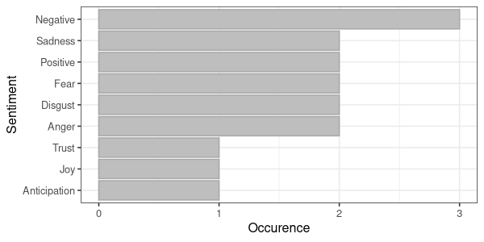
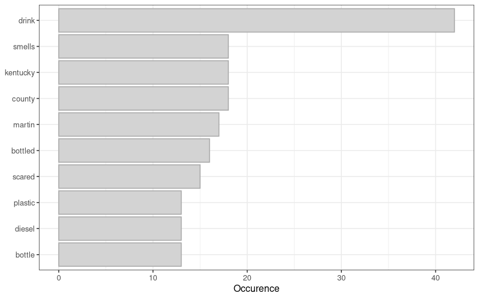
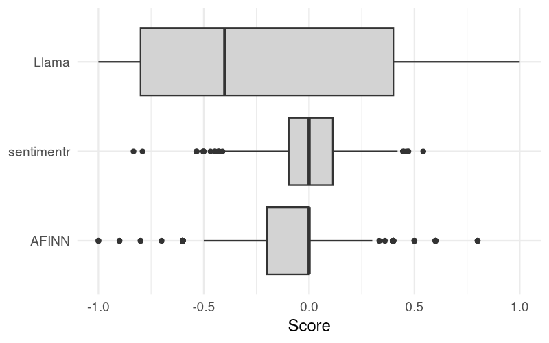

#+title: Sentiment Analysis
#+property:     header-args:R :session *R* :colnames yes :tangle scripts/04-sentiment-analysis.R :exports results :results value
#+bibliography: book/voc.bib
#+macro: voc /Voice of the Customer/

The main purpose of a {{{voc}}} (VOC) program is to determine how customers feel about the level of service or other aspects of the offering. Sentiment analysis, sometimes also called opinion mining, asks questions such as: Are customers frustrated or delighted with the billing process?; How do they feel about drinking tap water; or, what are their attitudes towards a new wastewater treatment plant in their community?

The purpose of sentiment analysis is to extract the state of mind of the author when they wrote or spoke their words. Extracting a sentiment from a text is a bit like electronic mind reading because we try to ascertain what customers were thinking or feeling when they wrote or spoke their words. While we can't read a customer's mind, we can read their words or a transcription of their spoken words and infer how they felt. Humans have evolved to assess somebody's state of mind through their words, body language, facial expressions and other environmental quest, but for computers this task is a bit more challenging.

Sentiment analysis provides of a toolbox of techniques to determine emotional content of communication and the valance (strength) of this emotion. Computational sentiment analysis techniques range from joining a text to a sentiment lexicons and count the words that express a feeling to supervised machine learning that compares a text with a set of examples. More recently, Large Language Models are also able to classify texts into sentiments. This chapter introduces each of these techniques and discusses their strength and weaknesses. This chapter closes with a case study analysing the sentiments towards tap water of a collection of social media posts.

* What is a sentiment?
A sentiment is an attitude towards a topic which, in the case of water utilities, could be tap water, a specific projects, pricing or anything else the utility seeks feedback on. A more formal definition is that a sentiment is an "attitude, thought, or judgment prompted by feeling", for example "I am concerned about the water levels in the reservoir". Opinion mining is a subtly different to sentiment analysis. An opinion is a concrete view, a judgment, or an appraisal formed in the mind about a particular matter. An example of an opinion statement is: "I don't think the reservoirs are full enough to meet the community's needs". Sentiments relate to opinions in that they are the underlying positive or negative feeling implied by an opinion [cite:@liu_2020_sent]. 

The emotional tone or attitude expressed in a piece of text, such as the positive words "happy", or "satisfied", or negative words such as "unhappy", "dissatisfied"). Neutral , or neutral (e.g., factual, objective).

A sentiment is an opinion that expresses or implies a positive or negative attitude.

Extracting sentiments from a text is a bit like mind reading. 

Language also includes sound and gestures. [Deep learning]

- Valence: The strength of the sentiment. Measures whether the emotional content is positive or negative.
- Emotion: Qualitative label of the type of sentiment

For example, the phrase "Tap water taste awful but I love bottled water" has negative sentiment with respect to tap water, but expresses a positive sentiment about bottled water. Analysing the sentiment towards a specific topic is called aspect sentiment analysis. 

* Use cases
Determining the sentiment of customers is an important 

Sentiment analysis enhances the engineering intelligence collected about tap water services. while utilities measure "hard" metrics (pressure, turbidity), sentiment captures the "soft" but critical metrics of Trust and Legitimacy. A customer might have perfect water pressure but feel "frustrated" because the billing UI is difficult.

* Techniques
Interpreting emotions from a written text comes natural to humans, which is part of the pleasure of reading fiction. Through the text we are able to transport ourselves into the lived experience of the protagonist. But when faced with thousands or even millions of paragraphs the manual method no longer suffices to make sense of it all and we need assistance from a machine. Sentiment analysis, also called opinion mining, first appeared with the advent of the internet in the last years of the previous century. Sentiment analysis is a collection of techniques to extract a sentiment from a text using computation [cite:@mao_2024_sent]. The three methods outlined and compared in this chapter are:

- Sentiment lexicons
- Supervised machine learning
- Large Language Models

Table [[tab-sent-ex]] displays six sample sentences used to demonstrate these sentiment analysis techniques. The first sentence is straightforward, but the second one contains a valence shifter ("not too") that modifies "bad". The third statement is not necessarily a negative sentiment related to the level of service, but a statement about the customer's personal situation. The fourth example expresses a negative sentiment, but only with the implied context that chlorine does not taste nice. If this sentence would be about the safety of drinking water, then chlorine would be a positive statement. The last sentence is one you might typically find in conspiracy forums. It expresses an opinion, but the context suggests a negative sentiment towards tap water. 

#+begin_src R
  # Sentiment Analysis examples

  library(tidytext)
  library(dplyr)

  # Generate test corpus
  sentences <- c("Tap water tastes awful",
                 "The water pressure is not too bad",
                 "I can't afford to pay the bill this month",
                 "How much water did I use last month?",
                 "The water tastes like chlorine",
                 "Fluoride in tap water calcifies the pineal gland")

  test_corpus <- data.frame(id = 1:length(sentences),
                            text = sentences)

  rename(test_corpus, No = id, Text = text)
#+end_src
#+caption: Example sentences.
#+name: tab-sent-ex
#+RESULTS:
| No | Text                                             |
|----+--------------------------------------------------|
|  1 | Tap water tastes awful                           |
|  2 | The water pressure is not too bad                |
|  3 | I can't afford to pay the bill this month        |
|  4 | How much water did I use last month?             |
|  5 | The water tastes like chlorine                   |
|  6 | Fluoride in tap water calcifies the pineal gland |

While it is easy for humans to asses a sentiment of a sentence, when faced with the task of assessing millions of such statements we need to find a method to automate this process. Perhaps before proceeding with reading this chapter you could manually rate these sentences between $-1$ and $+1$ and compare your scores with the computed versions.

** Lexicon Methods
:NOTES:
Phrases, such as "tap water costs me an arm and a leg" also express sentiments, but through a .
:END:
The prime indicators of emotional content are sentiment or opinion words. These are words that express an attitude, such as /good/, and /perfect/ or /horrible/ and /bad/. These sentiment words and phrases are made available in sentiment lexicons. These lexicons are created by recruiting people to assess a collection of words [cite:@liu_2020_sent].

The basic method to assign a sentiment score or label to a string of words is to join the tokenised text to a sentiment lexicon. For example, in the sentence: "Tap water tastes awful" the last word would appear in a sentiment lexicon with a negative valence and the sentence is assigned a negative sentiment. This method does not determine the aspect of the sentiment, just that the string of words contains a majority of positive or negative terms.

A large number of lexicons is available to analyse the sentiment of a text. Qualitative models assign an emotion to each sentiment word and quantitative models add valence, usually a score from negative to a positive.

Lexicon-based sentiment analysis occurs at the token level. To assign a sentiment to a text it needs to be split into unigrams and joined with the lexicon. We can then count the qualitative labels or assign a score by summarising the numeric valences.

The NRC and Loughran qualitative lexicons label each sentiment word, providing terms such as "fear", "disgust" or "surprise" and a "positive" or "negative" valence [cite:@mohammad_2012_crow;@loughran_2011_when;]. Some words in these lexicons have multiple labels because of the polysemy of human language. The Bing lexicon assigns a 'positive' or 'negative' label to each sentiment word [cite:@hu_2004_minin]. These labels can  be converted to a numeric value of either $+1$ or $-1$. Table [[tab-lexicons]] shows how the example sentence "Water restrictions are bad for wellbeing" is assessed by the AFINN, Bing and Loughran lexicons. The AFINN method assigns -3 to the sentence because of the word "bad". The Bing lexicon stays on  the fence because wellbeing is scored positively. The Loughran dictionary labels this sentence with as a negative constraining sentiment.

#+begin_src R :eval no
# Compare lexicon methods
data.frame(text = "Water restrictions are bad for wellbeing") |>
  unnest_tokens(word, text) |>
  left_join(get_sentiments("afinn"), by = "word") |>
    rename(AFINN = value) |>
    left_join(get_sentiments("bing"), by = "word") |>
    rename(Bing = sentiment) |>
    left_join(get_sentiments("loughran"), by = "word") |>
    rename(Loughran = sentiment, Lexicon = word) |>
    mutate(across(everything(), ~ replace(., is.na(.), ""))) |>
    t() 
#+end_src

#+caption: Comparing lexicon sentiment assignments.
#+name: tab-lexicons
| Lexicon  | water | restrictions | are | bad      | for | wellbeing |
|----------+-------+--------------+-----+----------+-----+-----------|
| AFINN    |       |              |     | -3       |     |           |
| Bing     |       |              |     | negative |     | positive  |
| Loughran |       | constraining |     | negative |     |           |

When joining the six example sentences from table [[tab-sent-ex]] to the NRC lexicon we can count the occurrence of each sentiment and valence term, as shown in figure [[fig-sent-nrc]]. This analysis shows that negative sentiment words dominate the text.

#+header: :file images/sentiment-nrc.png :width 600 :height 300
#+begin_src R :results output file graphics
  # Visualise emotive labels
  # Use NRC lexicon
  nrc <- test_corpus |>
    unnest_tokens(word, text) |>
    left_join(get_sentiments("nrc")) |>
    filter(!is.na(sentiment)) |>
    count(sentiment) |>
    mutate(sentiment = fct_reorder(str_to_title(sentiment), n))

  # Set standard theme
  library(ggplot2)
  set_theme(theme_bw(base_size = 16))

  ggplot(nrc) +
    aes(sentiment, n) +
    geom_col(fill = "grey", col = "darkgrey") +
    coord_flip() + 
    labs(x = "Sentiment", y = "Occurence")
#+end_src
#+caption: Example of NRC lexicon emotion words and valence.
#+name: fig-sent-nrc
#+RESULTS:

The AFINN model assigns a score between -5 and +5 to each word, proving some more granularity of the sentiments [cite:@nielsen_2011_anew]. Just like the qualitative lexicons, each word in a text that appears in the sentiment lexicon is assigned a numeric value. The result is a vector of numbers for each sentence. For example, the sentence "The utility provides disgusting water and can be frustrating" is assigned $-5$ in the AFINN lexicon. The word "disgusting" has a score of $-3$ and "frustrating" $-2$. The other words are all considered neutral and receive no score. So in lexicon sentiment analysis, each text is converted to a vector of number, which in this example is: $0, 0, 0, -3, 0, 0, 0, 0, -2$.

#+begin_src R :eval no
  data.frame(s = "The utility provides disgusting water and can be frustrating.") |>
    unnest_tokens(word, s) |>
    left_join(get_sentiments("afinn"))
#+end_src

We can extract some value from these vectors. In simple terms, the total valance of the sentence in this example is $-5$ being the sum of the vector.

- Sentiment
- Subjectivity

valence is quantified by the ratio or difference between positive and negative words (Shah et al., 2023).

Subjectivity measures how loaded the conversation is with emotion versus being neutral. It is the ratio of sentiment-bearing words to the total word count.

$$\text{subjectivity}=​\frac{\text{positive} + \text{negative}}{\text{total words}}$$

The example sentence has 9 words and two negative sentiment words, which results in a subjectivity score of 0.22. The higher the subjectivity score, the more emotive the language. A score of zero would be a boring factual statement.

A high subjectivity score implies that the speaker uses many emotional or evaluative words, such as "fantastic," "terrible," "helpful," or "broken". A low subjectivity score implies that the speaker is objective or transactional ("The billing cycle is 30 days". Not that an objective sentence is not necesarily a true sentence.

Table [[tab-afinn]] shows an example of lexicon sentiment analysis using the AFINN dictionary. This method assigns a score to each word in a sentence that matches a lexicon words. When a text contains more than one sentiment word, the average AFINN score  is used. When a sentence does not contain any sentiment words, the score is 0 (neutral).

#+begin_src R
  # AFINN method

  # Tokenise in to single words and apply AFINN lexicon
  library(dplyr)
  library(tidytext)

  sentiments_afinn <- test_corpus |>
    unnest_tokens(word, text) |>
    left_join(get_sentiments("afinn"), by = "word") |>
    group_by(id) |>
    summarise(word_count = n(), 
              pos_sum = sum(value[value > 0], na.rm = TRUE),
              neg_sum = abs(sum(value[value < 0], na.rm = TRUE)),
              net_sum = sum(value, na.rm = TRUE)) |>
    right_join(test_corpus, by = "id") |>
    select(-text) |> 
    mutate(valence = if_else((pos_sum + neg_sum) != 0, 
    (pos_sum - neg_sum) / (pos_sum + neg_sum), 0),
    sentiment = round(net_sum / word_count, 1),
    subjectivity = round((pos_sum + neg_sum) / word_count, 1))

  # Present the results
  test_corpus |>
    left_join(sentiments_afinn) |>
    select(Text = text, Total = net_sum, Valence = valence,
           Sentiment = sentiment, Subjectivity = subjectivity)
#+end_src
#+caption: Example of sentiment analysis using the AFINN model.
#+name: tab-afinn
#+RESULTS:
| Text                                             | Total | Valence | Sentiment | Subjectivity |
|--------------------------------------------------+-------+---------+-----------+--------------|
| Tap water tastes awful                           |    -3 |      -1 |      -0.8 |          0.8 |
| The water pressure is not too bad                |    -4 |      -1 |      -0.6 |          0.6 |
| I can't afford to pay the bill this month        |    -1 |      -1 |      -0.1 |          0.1 |
| How much water did I use last month?             |     0 |       0 |         0 |            0 |
| The water tastes like chlorine                   |     2 |       1 |       0.4 |          0.4 |
| Fluoride in tap water calcifies the pineal gland |     0 |       0 |         0 |            0 |

The table shows two problems. The second line is scored negatively because the method did not capture the word "not". The sentiment for the last two lines are ostensibly wrong. The word "like" is scored as a positive sentiment because the dictionary approach cannot distinguish verbs from nouns. A standard lexicon cannot understand that something tasting "like chlorine" expresses a negative sentiment because "like" is a positive word. The last line is gramatically a neutral statement, but expresses a conspiracy theory that relates to the presumed effects of fluoride on the brain. Even though the statement is factually incorrect, it expresses a negative sentiment.

More advanced models combine sentiment lexicons with

valence shifters

- Negation words: ("good" versus "not good")
- Amplification words ("good" versus "very good")
- Attenuation words ("low versus "somewhat low")

The sentimentr package by Tyler W. [cite/t:@rinker_2021] attempts to account for valence shifters, providing an augmented dictionary lookup. This method provides a more involved approach because it uses tri-grams to account for negation, amplification and attenuation words. 

#+begin_src R
  # Sentimentr package
  # https://cran.r-project.org/web/packages/sentimentr/
  library(sentimentr)

  # Caluclate sentiment scores
  sentiments <- sentiment(sentences)

  # Display
  test_corpus |>
    mutate(Sentiment = round(sentiments$sentiment, 2)) |>
    select(Text = text, Sentiment)
#+end_src
#+caption: Example of sentiment analysis using the sentimentr package.
#+name: tab-sentimentr
#+RESULTS:
| Text                                             | Sentiment |
|--------------------------------------------------+-----------|
| Tap water tastes awful                           |     -0.38 |
| The water pressure is not too bad                |      0.47 |
| I can't afford to pay the bill this month        |     -0.13 |
| How much water did I use last month?             |         0 |
| The water tastes like chlorine                   |      0.22 |
| Fluoride in tap water calcifies the pineal gland |         0 |

Also this method doesn't provide perfect scores for each sentiment. The model is unaware of the water utility context and thus scores the last line as a positive sentiment. In fact, no model will ever provide a perfect sentiment score for each individual text chunk. Sentiment analysis is a statistical technique that works best when reviewing a large number of texts. 

These sentiment analysis methods are fully deterministic, meaning that it provides the illusion of a single true score of a sentiment. But the intricacies of human language make it difficult to 

Machine learning methods, including Large Language Models can provide more nuanced scores, but

** Supervised Machine Learning
From a machine learning perspective, sentiment analysis is a classification task. Each chunk of text that we want to assess is classified into a positive or negative sentiment, or perhaps numerically between a minimum and maximum score. Supervised model means that we first train a model on a large set of data that has been previously labelled by humans. The algorithm then analyses the Document-Term Matrix (DTM) of the training data to build a mathematical relationship between the DTM and the human labels.

The main difference between a sentiment lexicon and a training data set is that we have human-labelled sentiments for whole sentences. This means that some of the subtleties of language that a lexicon misses can be accounted for. A machine learning approach can model the specific context of the topic under analysis. We could, for example, hold a survey among water professionals to assess the sentiment of a set of sentences to be used to train a model. Unfortunately, a specific training set for water utilities does not currently exist. Some data sets for emotion detections are freely available 

Machine learning often requires training data which are not easy to acquire because of the human labour involved. Machine learning is also more computationally expensive in terms of CPU processing, memory requirements, and training/classification time. Lastly, these models present a black box that is not easily human-interpretable and are therefore more difficult to either generalise, modify [cite:@hutto_2014_vader]

** Large Language Models
The most recent method to extract the sentiments is using a Large Language Model (LLM). These models have been trained on vast amounts of text which enables them to parse the nuances of human language. A sentiment classifier with an LLM as its engine will be able to produce more accurate results than lexicons or supervised machine learning. But this accuracy comes at a computational cost by consuming tokens for cloud applications or high computing needs when using local models.

LLMs can assign a sentiment to a text with pattern prompting. These are prompts where the LLM is provided with a template to narrow the possible output. All we need from the model is a number or a label, no long winded explanations. We can achieve this with a system prompt that instructs the model to act as a sentiment classifier. A system prompt is a set of foundational instructions given to a model that defines its role, context, and specific behaviour, such as directing it to act exclusively as a specialised sentiment classifier. This example is a zero-shot prompt for a sentiment classifier:

#+begin_quote
You are an analyst that performs sentiment analysis on text about tap water, you must score each text with a floating-point number representing the sentiment of the text on a scale from -1.0 (negative) to 1.0 (positive), where 0.0 represents neutral sentiment.
#+end_quote

This prompt can be further enhanced by providing examples of how certain sentences should be scored, which is called a few-shot prompt. 

Table [[tab-llama-sent]] contains the sentiment scores for the example sentences as provided by Meta's Llama 3.1 model using the above-mentioned sentiment analysis system prompt. This model is able to correctly score the conspiratorial comment about the pineal gland. Without context, this sentence is a neutral statement of presumed fact. A lexicon sees "Fluoride" (Neutral) and "Gland" (Neutral), resulting in a neutral sentiment. Supervised machine learning can only score this sentence if the training data contains specific examples. However, an LLM interprets this information as a case of misinformation and distrust and as such scores it negative.

#+begin_src R :eval no
  # Ollamar library to interact with local LLMs
  library(ollamar)
  library(httr2)
  library(purrr)

  # Function to score a vector of sentences
  score_sentiments <- function(sentences, model = "llama3.1:latest", temp = 0) {
    system_prompt <- "You are an analyst that performs sentiment analysis on text towards tap water, you must score each text with a floating-point number representing the sentiment of the text in a scale from -1.0 (negative) to 1.0 (positive), where 0.0 represents neutral sentiment. Provide ONLY the number as your response."
    # Define the list of prompts
    requests <- lapply(sentences, function(text) {
      msgs <- create_messages(create_message(system_prompt, role = "system"),
                              create_message(text, role = "user"))
      chat(model = model,
           messages = msgs,
           output = "req",
           temperature = temp)})
    
    message(paste("Processing", length(sentences), "sentences ..."))
    
    # Run the API
    responses <- req_perform_parallel(requests)
    
    # Process the responses
    scores_raw <- sapply(responses, resp_process, "text")
    scores_numeric <- round(as.numeric(gsub("[^0-9.-]", "", scores_raw)), 1)
    return(data.frame(sentences, scores_raw, scores_numeric))
  }

  score_sentiments(test_corpus$Text) |>
    select(Text = sentences, Sentiment = scores_numeric)
#+end_src
#+caption: Example of sentiment analysis using the Llama 3.1 model.
#+name: tab-llama-sent
#+RESULTS:
| Text                                             | Sentiment |
|--------------------------------------------------+-----------|
| Tap water tastes awful                           |      -0.8 |
| The water pressure is not too bad                |       0.2 |
| I can't afford to pay the bill this month        |      -0.8 |
| How much water did I use last month?             |         0 |
| The water tastes like chlorine                   |      -0.7 |
| Fluoride in tap water calcifies the pineal gland |      -0.8 |

One disadvantage of sentiment analysis with an LLM is that the scores are non-deterministic because of the stochastic mature of this technology. In its natural state, every time the model runs results in a different score. When, for example, processing the third sentence 100 times with the Llama 3.1 model, the sentiment score is between -0.93 and -0.40 and an average of 0.70. We can rectify this problem by lowering the temperature of the model. Most LLMs have a temperature setting which controls the level of randomness (and as such simulated creativity). Setting the temperature of the Llama 3.1 model to zero results in a stable score for each line. However, scores can vary greatly between models because they use different source data and training methods. Some models tend to be more positive while other models are biased towards negative views [cite:@jukiewicz_2025].

Another issue to be mindful of is that many LLMs have inbuilt censors that prevent them from processing obscenity and other types of offensive language. When trying to extract a sentiment from such a statement, the model will not comply with instructions and generally provide a generic response. Any classifier in an LLM needs to contain a mechanism to ensure that these non-compliant outputs are captures. The classifier provided in this example only accepts numeric outputs.

#+begin_src R :eval no
  # Test variance of LLM responses (change temperature or model name)
  score_sentiments(rep("I can't afford to pay the bill this month", 100), 
                   temp = 1) |> 
    dplyr::pull(scores_numeric) |>
    summary()
#+end_src

* Case Study
:NOTES:
- [X] https://lucidmanager.org/data-science/tap-water-sentiment-analysis/
:END:
This case study uses an extract of 301 Tweets extracted in March 2018 from the social media platform formally known as Twitter. These messages all contain the words "tap water". A point of interest is that this data was extracted around the time of a tap water aesthetic problem in Kentucky (figure [[fig-tapwater-tweets-words]]).

The first step in cleaning the data is to create unigrams, which involve splitting the tweets into individual words that can be analysed. The first step is determining which words are most commonly used in the tap water tweets and visualising the result. The most common phrases are related to drinking and bottled water, which makes sense. The recent issues in Kentucky feature in this list.

#+header: :width 800 :height 500
#+begin_src R :results output file graphics :file images/sentiment-tap-water-tweets-words.png
  # Tap water tweets case study
  library(stringr)
  library(stringi)
  library(readr)
  library(ggplot2)

  # ETL
  tapwater_tweets <- read_csv("data/tapwater_tweets.csv") |>
    mutate(text = stri_enc_toutf8(text),
           text = str_replace_all(text, "https?://\\S+|www\\.\\S+", ""),
           text = str_replace_all(text, "@\\w+", ""),
           text = stri_replace_all_regex(text, "[^\\p{L}\\p{N}\\p{P}\\p{Z}]", " "),
           text = str_squish(text),
           id = as.factor(id)) |>
    filter(!is.na(text), text != "")

  ## Tokenise and clean the tweets
  tidy_tweets <- tapwater_tweets |>
    unnest_tokens(word, text) |>
    anti_join(stop_words) |>
    filter(!word %in% c("tap", "water", "rt", "gt", "amp", as.character(0:9)))

  ## Most common words
  tidy_tweets_count <- tidy_tweets |>
    count(word, sort = TRUE) |>
    top_n(10) |>
    mutate(word = reorder(word, n))

  ggplot(tidy_tweets_count) + 
    aes(word, n) +
    geom_col(fill = "lightgrey", col = "darkgrey") +
    labs(x = NULL, y = "Occurence") + 
    coord_flip()
#+end_src
#+caption: Ten most common words in March 2018 tap water tweets (/n/ = 301).
#+name: fig-tapwater-tweets-words
#+RESULTS:

The sentiment analysis compares the above-discussed methods: the AFINN method [cite:@nielsen_2011_anew], the sentimentr R package [cite:@rinker_2021] and using the Llama model version 3.1. Some of the tweets were not scored by Llama due to obscene language. The model provided a text response instead of a number. The boxplots in figure [[fig-tapwater-tweets-sentiments]] visualise the difference in the distribution of scores for these three methods. The AFINN scores were divided by five to normalise them from $-1$ to $+1$.

The median scores (bold lines) for the deterministic methods are almost the same, but the AFINN method has more outliers than the sentimentr model. The scores provided by Llama have a much higher variance (grey box and whiskers) and a lower median. AFINN uses a simple word-matching approach, while sentimentr is more advanced and accounts for grammatical nuances. These models are conservative and rarely assign minimum of maximum scores, unless the text is very long and full of emotional words. As a Large Language Model, Llama can capture context. In this case study, Llama frequently assigned extreme values as the boxplot covers the complete domain from -1 to +1.

Llama shows the highest variance because it is likely capturing nuances in customer "voice" (e.g., frustration with tap water quality) that word-matching algorithms miss. This message is an example of where the models disagree. While AFINN and sentimentr focus on the negative words and assign it a negative score, Llama was able to detect that this is a highly positive statement about tap water.

#+header: :width 800 :height 500
#+begin_src R :results output file graphics :file images/sentiment-analysis-comparison.png
  # Sentiment analysis multiple methods
  library(magrittr)
  library(tidyr)
  library(forcats)
  library(sentimentr)

  # AFINN lexicon
  tweets_afinn <- tidy_tweets |>
    inner_join(get_sentiments("afinn")) |>
    group_by(id) |>
    summarise(AFINN = mean(value)) |>
    mutate(AFINN = AFINN / 5)

  # sentimentr
  tweets_sentimentr <- tapwater_tweets %$%
    sentiment_by(get_sentences(text),
                 list(id)) |>
    select(id, sentimentr = ave_sentiment)

  llama_results <- "data/tapwater_tweets_sentiments__llma.csv"

  # file.remove(llama_results)

  if (!file.exists(llama_results)) {
    sentiments_llama <- score_sentiments(tapwater_tweets$text)
    
    tweets_llama <- tapwater_tweets |>
      bind_cols(sentiments_llama, by = c("text" = "sentences")) |>
      select(id, Llama = scores_numeric)

    write_csv(tweets_llama, llama_results)
  } else {
    tweets_llama <- read_csv(llama_results) |>
      mutate(id = factor(id))}

  # Combine results and visualise / analyse
  tapwater_sentiments <- tapwater_tweets |> 
    left_join(tweets_afinn) |>
    mutate(AFINN = if_else(is.na(AFINN), 0, AFINN)) |>
    left_join(tweets_sentimentr) |>
    left_join(tweets_llama) |>
    select(-text) |>
    pivot_longer(-id, names_to = "Method", values_to = "Score") |>
    mutate(Method = fct_relevel(Method, c("AFINN", "sentimentr", "Llama")))

  ggplot(tapwater_sentiments) +
    aes(Method, Score) +
    geom_boxplot(fill = "lightgrey") +
    coord_flip() + 
    theme_minimal(base_size = 24) +
    labs(x = NULL)
#+end_src
#+caption: Comparison of sentiment analysis methods.
#+name: fig-tapwater-tweets-sentiments
#+RESULTS:

#+begin_src R :eval no
  # Compare sentiment distributions 
  tapwater_sentiments_test <- tapwater_sentiments |>
    filter(!id %in% tapwater_sentiments$id[is.na(tapwater_sentiments$Score)]) |>
    mutate(id = factor(id))

  friedman.test(Score ~ Method | id, data = tapwater_sentiments_test)
#+end_src

* Conclusion
This chapter introduced the concept of sentiment analysis using lexicons, supervised machine learning [method] and a local Large Language Models (Llama 3.1). 

The case study shows that each technique provides different scores to individual chunks of text, but when aggregated the outcomes are statistically similar. When analysing sentiments there is no absolute truth to benchmark our results. Even when using natural intelligence (human-rated sentiments), not everybody will score the same sentence the same way. There is no such thing as an accurate score for a sentiment. 

Basic lexicon methods are easy to use and are fully deterministic. However, they have a low contextual awareness. Augmented lexicon methods are more sensitive to context because they incorporate negations and other grammatical constructs to calculate a score. [machine learning] The Llama 3.1 sentiment scores have a higher variance than the other two methods, suggesting that it is able to detect subtleties in language. Table [[tab-sent-methods]] summarises the methods described in this chapter.

#+caption: Comparison of sentiment analysis methods.
#+name: tab-sent-methods
| Method            | Effort | Awareness | Replicability |
|-------------------+--------+-----------+---------------|
| Lexicon           | Low    | Low       | High          |
| Augmented lexicon | Low    | Medium    | High          |
| Machine learning  | High   | Medium    | High          |
| LLM               | High   | High      | Low           |

The choice of method is a tradeoff between processing capacity (effort), contextual awareness, and replicability. Using the latest LLM technology does not always guarantee better results. 

The lexicon method is suitable for 
